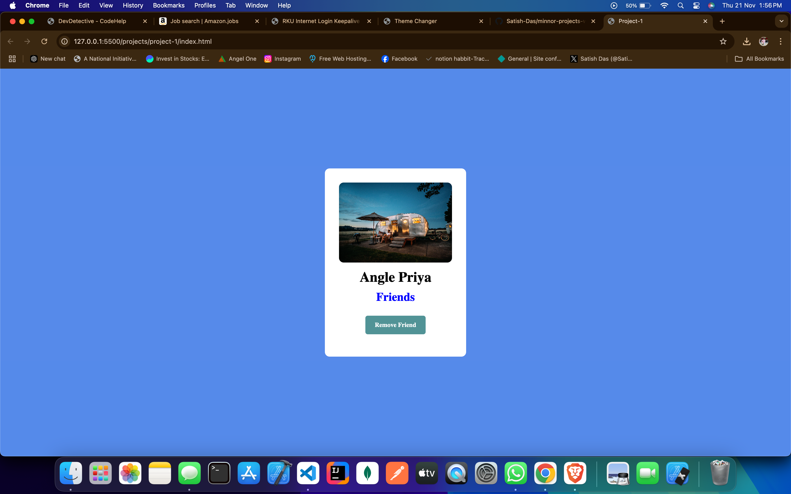

** Project 1: Add and Remove Friend Card **
* Description *
This is a simple web project featuring an interactive card that allows users to add or remove a friend with a button click. The card includes a profile picture, a name, and a status label.

* Features *

Displays a user profile with a picture, name, and status.
Add and remove friend functionality with a single button click.
Clean and responsive design.

* Technologies Used *
HTML: For the structure of the webpage.
CSS: For styling and layout.
JavaScript: For interactive functionality (e.g., toggling add/remove actions).

* How to Use * 

Clone the repository.
Open index.html in a browser.
Click the "Add Friend" button to toggle between adding and removing a friend.

* Screenshots *

