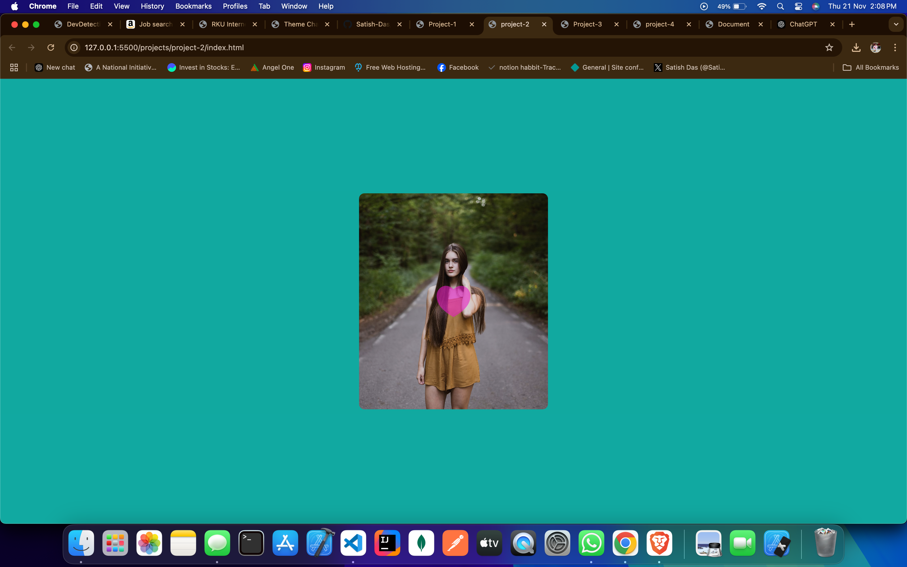

# Like Animation

This project demonstrates a simple and visually appealing "like" animation inspired by social media platforms like Instagram. The animation triggers when a user interacts with the like button, creating an engaging effect.

## Features
- Smooth and interactive "like" animation.
- Mimics the Instagram-like interaction with dynamic visuals.
- Simple and clean design using modern web technologies.

## Technologies Used
- **HTML**: To structure the content and button.
- **CSS**: For styling and animation effects.
- **JavaScript**: To trigger and control the animation.

## How to Use
1. Clone the repository.
2. Open the `index.html` file in your browser.
3. Click the "like" button to see the animation.

---
## Screenshots

