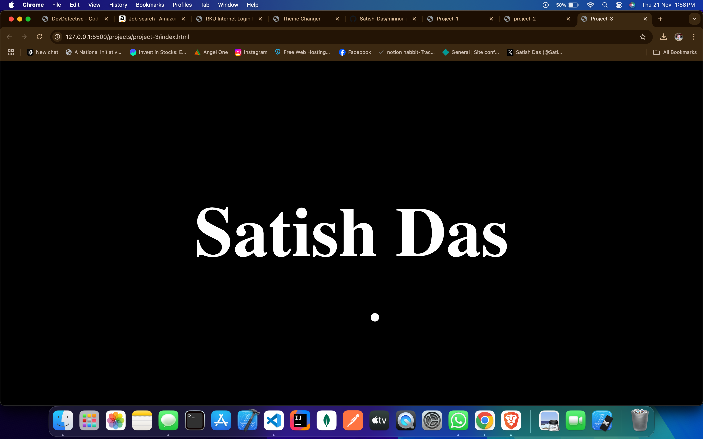

# Custom Cursor Animation

This project replaces the default system cursor with a custom-designed cursor using HTML, CSS, and JavaScript. It features smooth animations and interactive effects to enhance the user experience.

## Features
- Custom cursor design using CSS.
- Interactive effects that respond to user movements.
- Smooth animations for dynamic interactivity.
- Fully responsive and works across modern browsers.

## Technologies Used
- **HTML**: To structure the web page.
- **CSS**: For styling and creating the custom cursor design.
- **JavaScript**: For enabling interactivity and controlling animations.

## How to Use
1. Download or clone the repository.
2. Navigate to the project folder.
3. Open `index.html` in your browser to see the custom cursor in action.

## Future Enhancements
- Add different cursor styles for specific elements.
- Enable cursor trail animations or particle effects.
- Provide a toggle to switch between default and custom cursors.

---

#Screenshot
