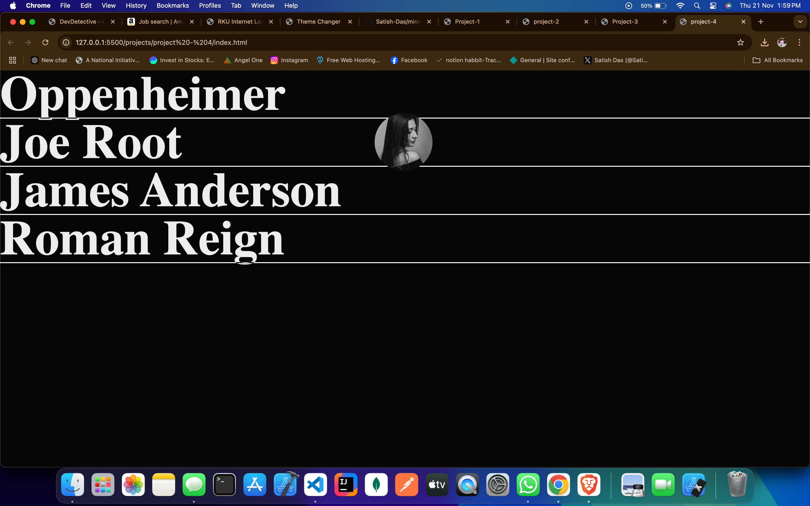
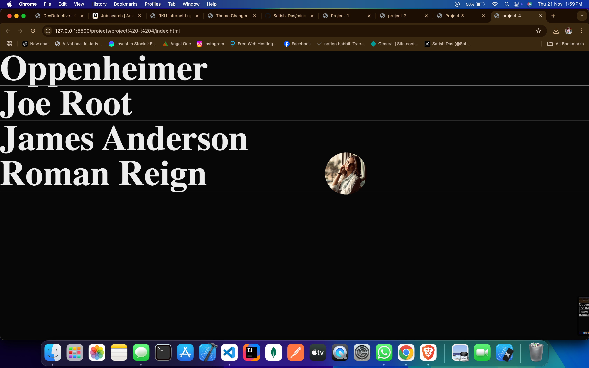

# Hover Animation on Text to Open Image

This project demonstrates an interactive hover effect where hovering over a text element reveals an image. The image appears with a smooth animation, enhancing the user experience and providing a dynamic interface. The effect is created using HTML, CSS, and JavaScript.

## Features
- Hover over text to reveal an image with a smooth transition.
- Customizable animation effects for text and image display.
- Modern and interactive design using HTML, CSS, and JavaScript.
- Fully responsive and works across modern browsers.

## Technologies Used
- **HTML**: For the structure of the webpage, including the text and image elements.
- **CSS**: For styling the hover effects, transitions, and animations.
- **JavaScript**: For handling the interactive behavior and triggering the animations.

## How to Use
1. Download or clone the repository.
2. Navigate to the project folder.
3. Open `index.html` in your browser.
4. Hover over the text to reveal the image with the animation effect.

---

#Screenshot

