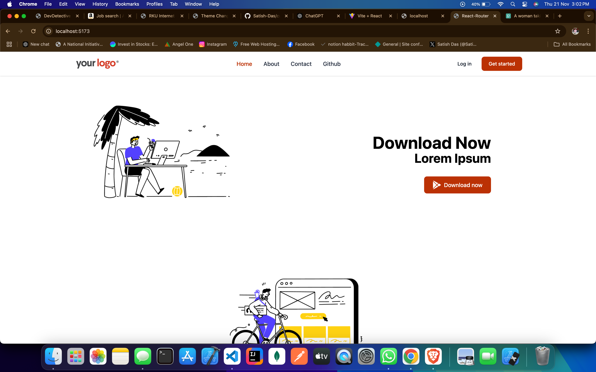
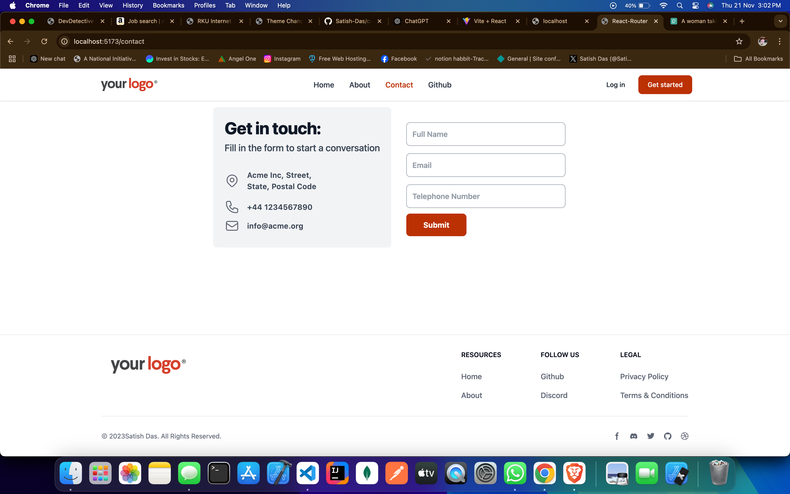

# React router app

A navigation application built with React. This app includes a navigation bar with links to **Home**, **About**, **Contact**, and a GitHub link.

## Features

- **Navbar with Links**: The navigation bar contains links to:
  - **Home**: The main page of the application.
  - **About**: A page describing the app and its purpose.
  - **Contact**: A page for contacting the app's creator or team.
  - **GitHub**: A link to the project's GitHub follower.
  
- **React Router**: Navigate between the pages without refreshing the browser.

## How This Project Helps You Learn React Router

This small project demonstrates the use of **React Router** to create a navigation bar with multiple pages in a React application. You will learn to:

- Set up routes using **React Router** to navigate between pages.
- Use `Link` components to enable smooth client-side navigation.
- Create simple pages like Home, About, Contact, and include an external link to GitHub.

## Installation

To run the project locally:

1. Download or copy the project files to your local machine.
2. Open a terminal and navigate to the project directory.
3. Install dependencies using npm:

   ```bash
   npm install


** Screenshots: **

# Home-page


# About-page


# Contact-page


# Github-page
