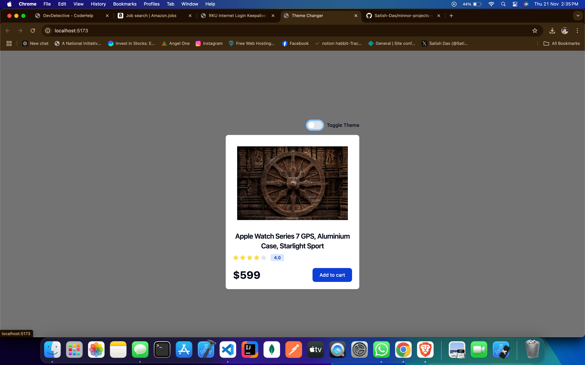
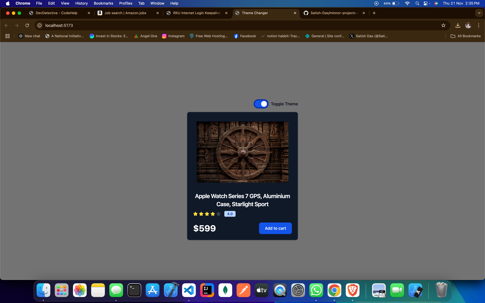

# Theme Switcher Application

A simple theme switcher application built with React. This app allows users to toggle between light and dark themes, providing a dynamic and responsive UI.

## Features

- **Light/Dark Mode Toggle**: Switch between light and dark themes with a button click.
- **Responsive Design**: The application adapts to different screen sizes.
- **Local Storage Persistence**: The user's theme preference is saved in the browser's local storage to persist between sessions.

## Installation

To run the project locally, follow these steps:

1. Download or copy the project files to your local machine.
2. Open a terminal and navigate to the project directory.
3. Install dependencies using npm:

   ```Terminal

   npm install

** Screenshots **


